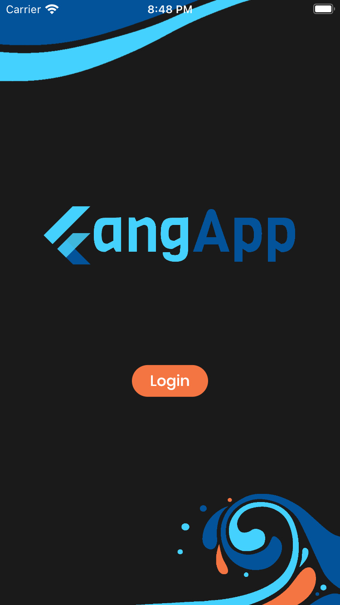
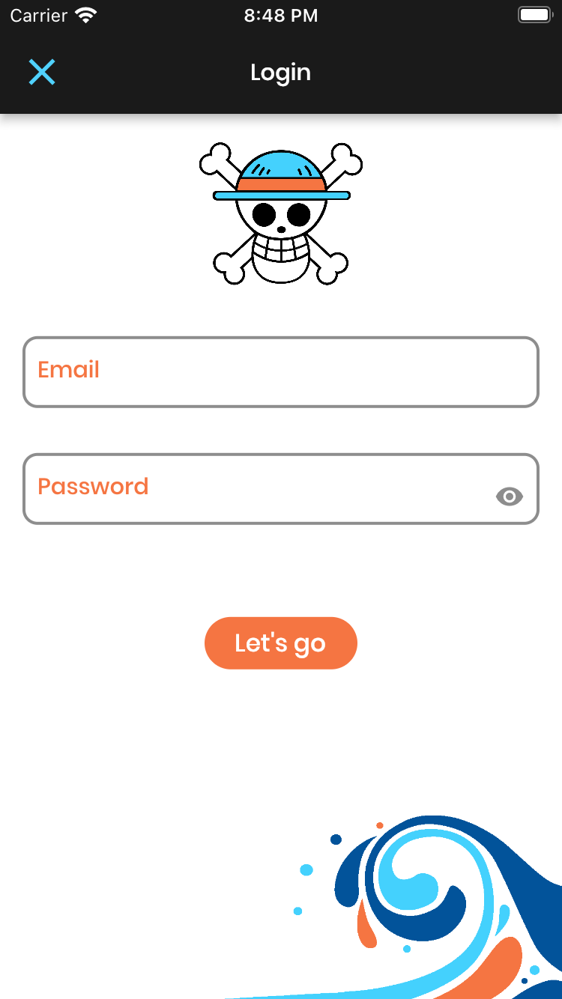
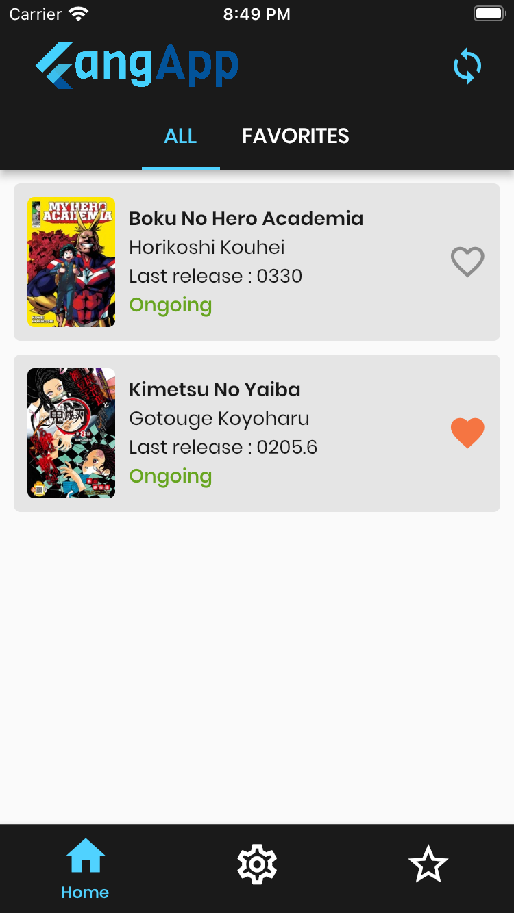
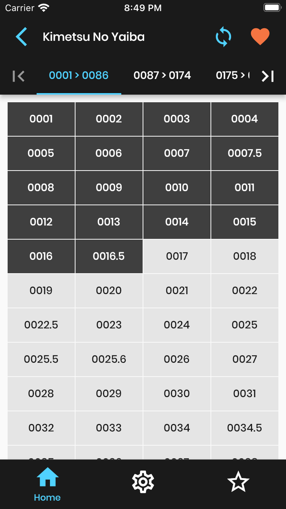
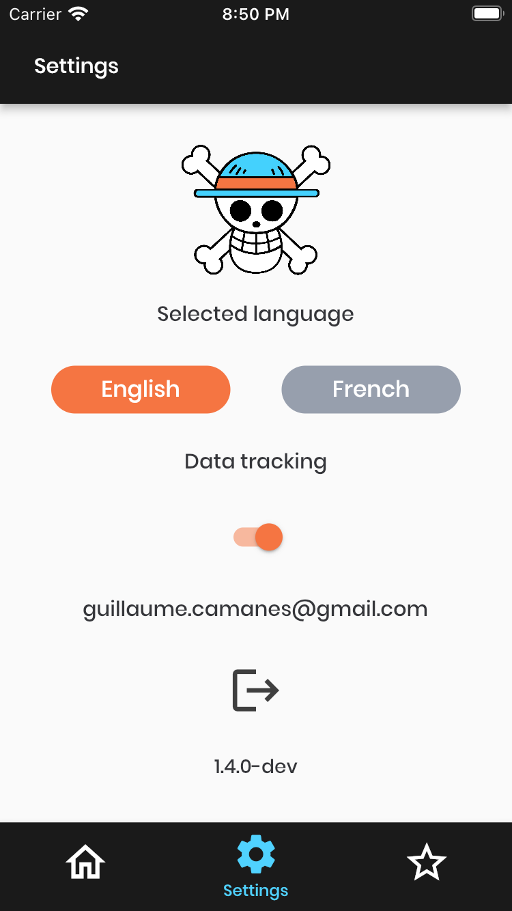
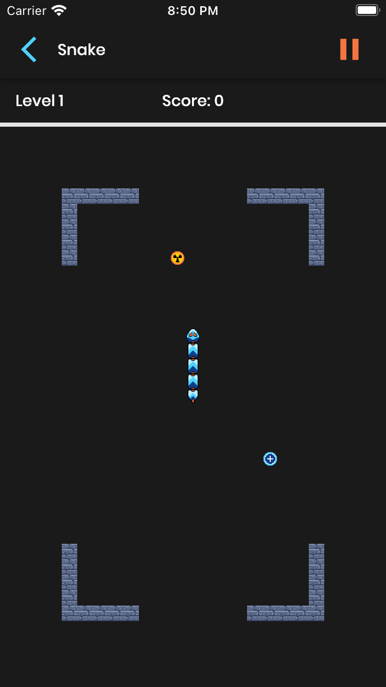
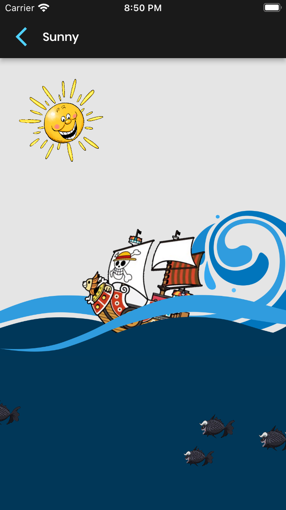

# FangApp

A flutter app to read mangas and see extra bonus content.
Back managed with Python3 and Firebase.

## Screenshots
> Login
<p float="left">
   
   
</p>

> Mangas, chapters and read feature
<p float="left">
   
   
   
</p>

> Settings
<p float="left">
   
</p>

> Bonuses
<p float="left">
   
   
</p>

## Getting Started

### Python3
> This part is needed to download manga from website and upload them to firebase project
1. Android Studio => Tools => Sync Python Requirements...
2. Select Python3 module
3. Firebase : open python file ```python/back_manager.py``` and follow SETUP instruction

### Flutter/ DART
> This part is needed to configure Android Studio and run the project
1. add configuration for main.dart
2. Android Studio => preferences => Languages and Frameworks => Dart  
   => specify Dart path (ex: /Users/you/development/flutter/bin/cache/dart-sdk)  
   => enable it for the project

> The project has two flavors : dev and prod

3. Create two configurations in Android Studio
4. Select main.dart as entry endpoint and add ```--flavor dev/prod```  in additional run args

### Firebase

> Firebase need specific files linked to project for each platform
1. Get the google-services.json from Firebase console and put it into  ```android/app/```
2. Get the GoogleService-Info.plist from Firebase console and put it into  ```ios/Runner/```
3. The one for prod should be renamed as GoogleService-Info-prod.plist
4. The one for dev should be renamed as GoogleService-Info-dev.plist

> To check analytics event in the debug view (Android)
1. Install Homebrew if not already installed
```  
/bin/bash -c "$(curl -fsSL https://raw.githubusercontent.com/Homebrew/install/master/install.sh)"  
```  
2. Install android tools
```  
brew install android-platform-tools  
```  
3. Connect real android device to mac and flutter run on it
4. Link with adb
```  
adb -d shell setprop debug.firebase.analytics.app com.groupany.fangapp  
```  

### Android signing
> Creation of the key store
```  
/Applications/Android\ Studio.app/Contents/jre/Contents/Home/bin/keytool -genkeypair -v -keyalg RSA -keysize 2048 -validity 10000 -keystore YOUR_KS.keystore -storepass KS_PASSWORD -alias ALIAS  
```  
you can find your java path with the command
```  
flutter doctor -v  
```